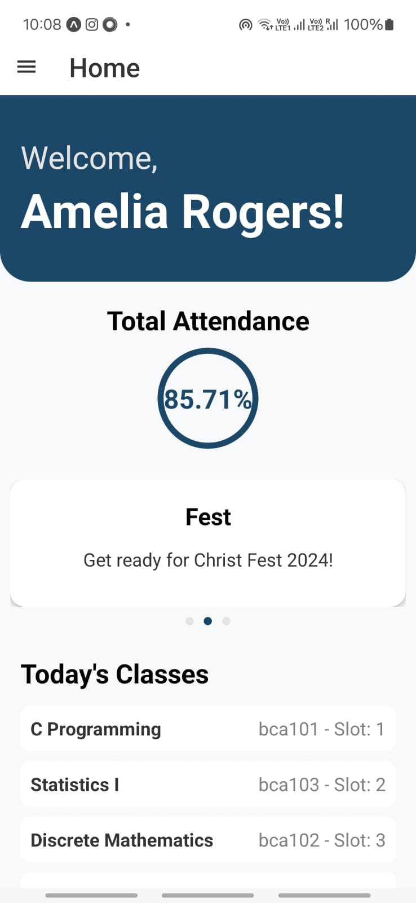
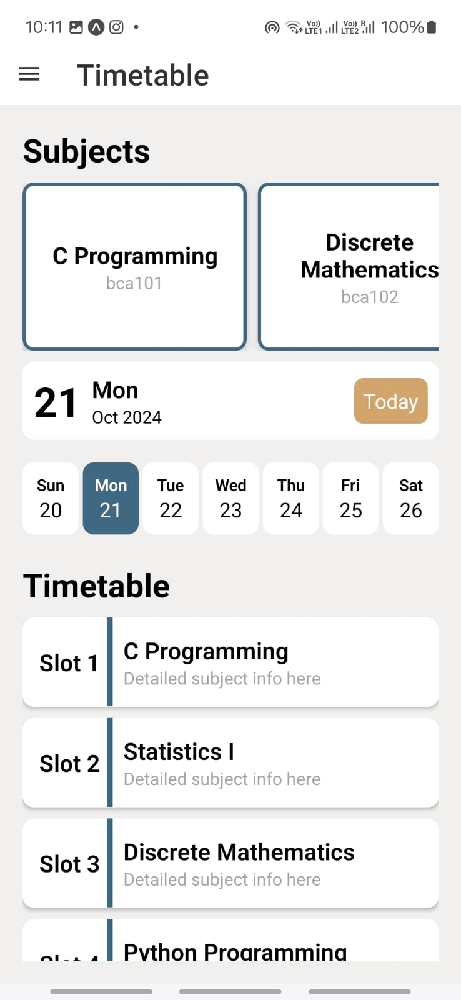
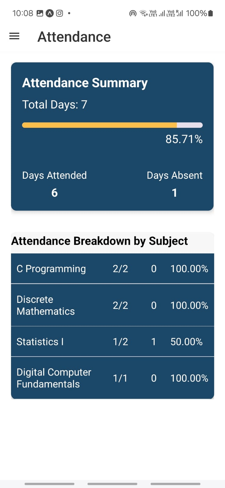
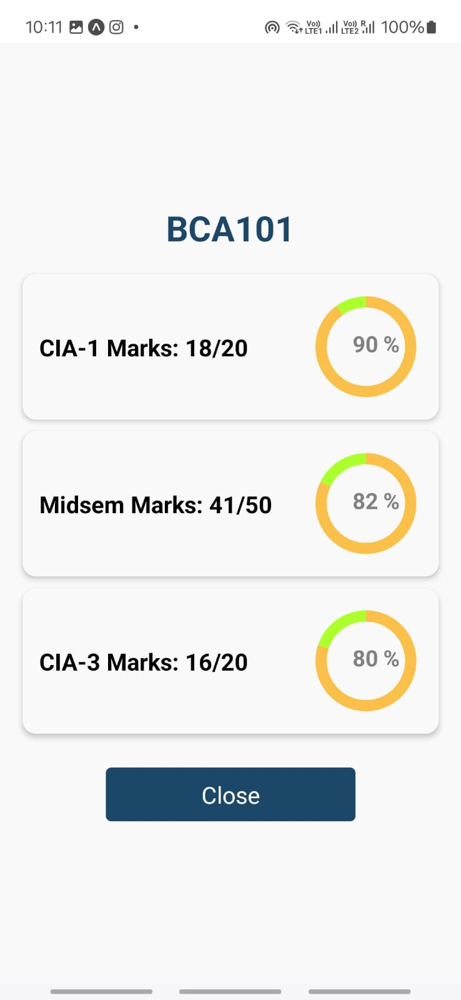

# CHRIST Student App
The CHRIST Student App is a university student management application designed for the students of CHRIST (Deemed to be University). It provides a centralized platform for students to access academic and personal information like attendance, grades, timetables, and more. The app also includes sections for announcements, clubs, and university resources to enhance student engagement and streamline their academic journey.
## Screenshots
### Home Page







## Features
- **Attendance Tracker**: Visual analytics to track attendance by subject and overall performance.
- **Marks Section**: Comprehensive display of Continuous Internal Assessment (CIA), mid-semester, and end-semester marks. Downloadable mark sheets.
- **Timetable**: Easy-to-navigate daily and weekly schedules.
- **Announcements**: Displaying the latest university news and events.
- **User Settings**: Dark/light mode preferences, notifications, and more.
- **Faculty Profiles**: Detailed staff contact information and office locations.
- **Student Support**: Access to support services and resources like forms, guides, and help centers.
## Tech Stack

- **Frontend**: React Native with Expo
- **Backend**: AppWrite
- **Languages**: JavaScript, Node.js
- **Database**: AppWrite Database
- **Version Control**: Git
## Installation

1. Clone the repository:
    ```bash
    git clone https://github.com/your-username/christ-student-app.git
    cd christ-student-app
    ```
2. Install dependencies:
    ```bash
    npm install
    ```
3. Set up AppWrite backend by following [AppWrite Documentation](https://appwrite.io/docs).

4. Run the app:
    ```bash
    npx expo start
    ```
